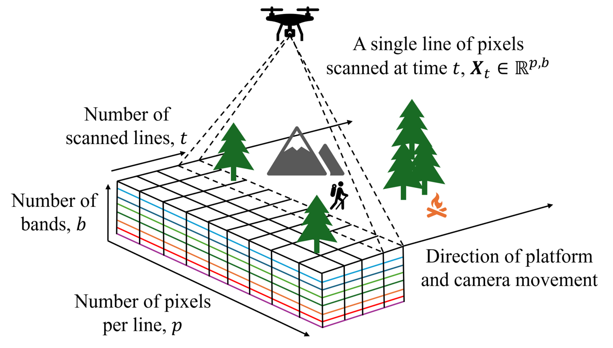
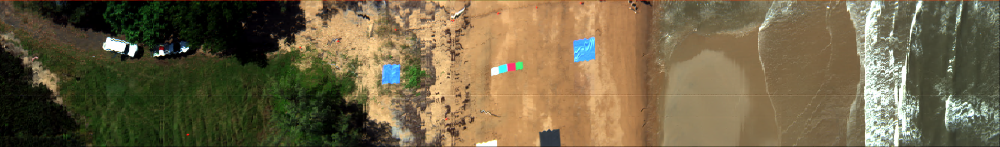
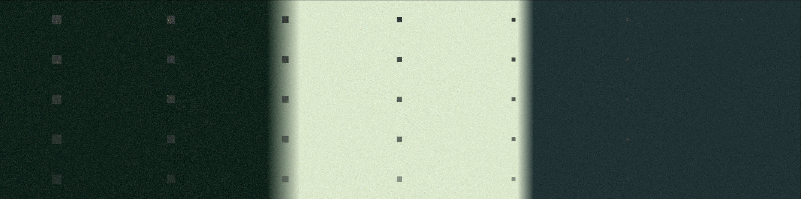
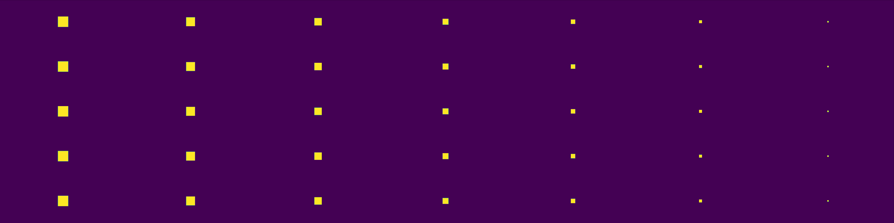
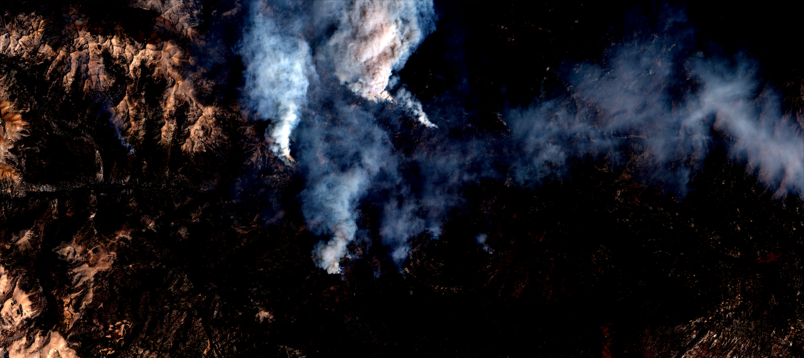
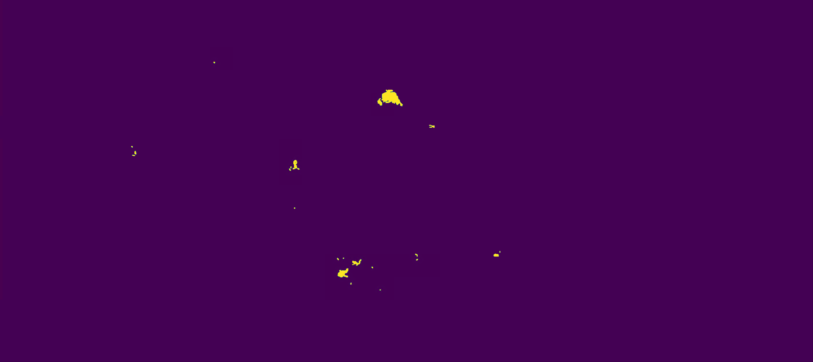

# HyperAD

HyperAD is a Python project that implements various RX-based real-time anomaly detection 
algorithms designed for hyperspectral line-scan cameras. It also proposes the Exponentially moving RX
algorithm (ERX) for this task. An example of ERX detecting live wildfires is shown below:

<div align="center">
 
 <p><em>Line-by-line anomaly detection of wildfires in the Sequoia National Park. The top image is the park,
and the bottom shows ERX's detection heatmap (Garske et al. 2024).</em></p>
</div>

## Contents
1. [Introduction](#introduction)
2. [How to Get Started](#quickstart)
3. [Datasets](#datasets)
4. [Line-Scan Simulation](#simulation)
5. [Experiments](#experiments)
6. [Cite this Work](#citing)

## Introduction <a name="introduction"></a>

Line-scan cameras capture one line of pixels at a time, and require the motion of an attached platform 
such as a drone, aircraft, or satellite to collect an image. They are an affordable way of collecting
hyperspectral images with high spectral and spatial resolutions.
<p align="center">
 
</p>
<p align="center">
 <em>A line-scan camera capturing one line of pixels at a time as it’s platform (e.g., a drone) moves 
     over the area of interest. These lines form a hyperspectral image, or datacube, with the depth dimension 
     b representing the spectral bands for each pixel (Garske et al. 2024).</em>
</p>


## How to Get Started <a name="quickstart"></a>

1. Install python (this project was built on Python 3.9).

2. Install requirements (ideally in a virtual environment):
```
pip install -r requirements.txt
```
3. You can run the speed test right away (it uses generated data):
```
cd test_speed
python3 run_speed_test.py
python3 show_speed_results.py
```
4. If you run into problems with the detectors, try this before rerunning step 3 again:
```
export PYTHONPATH=..
```
5. For the other experiments download the datasets from [here](https://zenodo.org/doi/10.5281/zenodo.13370799) and put them in a \data folder. Repeat step three for the other experimental directories, and make sure you update and check the configuration file for each experiment for where the data is stored.

Please feel free to raise any issues with this guide or the code in general.

## Datasets <a name="datasets"></a>
Three annotated datasets are openly available [here](https://zenodo.org/doi/10.5281/zenodo.13370799) in .npy format (height, width, channels for image files, and height, width for masks):
### Beach dataset - a natural coastal area with a variety of human-made anomalies present :car:


### Synthetic dataset - a constructed dataset using pixels sampled from AVIRIS with anomalous targets :dart:


### Sequoia National Park dataset - a national park with live wildfires present :fire: This image is Sentinel-2 data extracted using sentinelhub.



## Line-Scan Simulation <a name="simulation"></a>
The project simulates a line-scan camera by feeding each image dataset one line of pixels at a time 
to each detection algorithm. The simulation consists of two objects:
 - A sampler, which is used to store a hyperspectral image dataset and feed it line-by-line to the detector
 - A detector, which is the anomaly detection algorithm that processes each line.

The simulator and it's classes are contained in /utils/simulation_core.py, 
and the detection algorithms are in /detectors.

## Experiments <a name="experiments"></a>
Four experiments are contained in their own folders:
 1) test_speed - Tests the speed of the algorithms over increasing band/channel numbers.
 2) test_detection - Gets AUC of the algorithms for a given dataset.
 3) test_projection - An ablation study of sparse random projection.
 4) test_momentum - An ablation study of the exponentially moving mean and covariance.
ERX is evaluated for different momentum values, and when the component is removed.
 5) [TBC] threshold_gridsearch - finds optimal thresholds for each dataset. Still being updated.
## Cite this Work <a name="citing"></a>
If you use this repository or the datasets please cite this [preprint](https://arxiv.org/abs/2408.14947): 
```
@article{garske2024erx,
  title={ERX - a Fast Real-Time Anomaly Detection Algorithm for Hyperspectral Line-Scanning},
  author={Garske, Samuel and Evans, Bradley and Artlett, Christopher and Wong, KC},
  journal={arXiv preprint arXiv:2408.14947},
  year={2024},
}
```

If you use the beach dataset please cite the following paper as well:
```
@article{mao2022openhsi,
  title={OpenHSI: A complete open-source hyperspectral imaging solution for everyone},
  author={Mao, Yiwei and Betters, Christopher H and Evans, Bradley and Artlett, Christopher P and Leon-Saval, Sergio G and Garske, Samuel and Cairns, Iver H and Cocks, Terry and Winter, Robert and Dell, Timothy},
  journal={Remote Sensing},
  volume={14},
  number={9},
  pages={2244},
  year={2022},
  publisher={MDPI}
}
```
